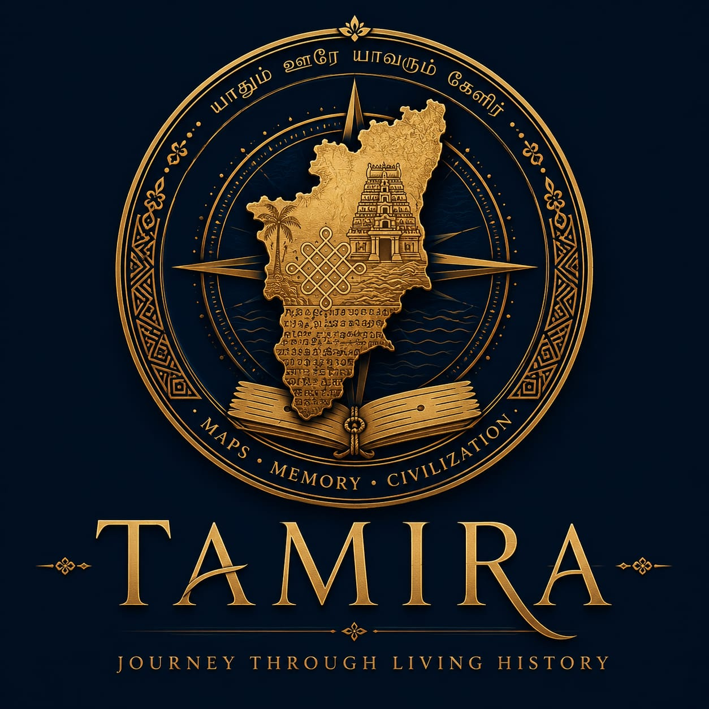

<div align="center">



# 📜 TAMIRA  
### Journey Through Living History

An immersive **Cultural Operating System** powered by AI, storytelling, heritage intelligence, and interactive exploration.

*TAMIRA is not a tourism app — it is a living cultural manuscript.*

</div>


---

<!-- Core Stack -->


<!-- Backend -->


<!-- AI -->


<!-- Architecture -->


<!-- Project -->


---

## 📑 Table of Contents

- Overview  
- Vision  
- Core Features  
- Vaigai AI – Cultural Intelligence  
- Multi-Language Accessibility  
- Design Philosophy  
- Technology Stack  
- System Architecture  
- Platform Modules  
- Project Goals  
- Future Roadmap  
- Run Locally  
- Mission Statement  

---

## 🌍 Overview

TAMIRA is a **next-generation cultural intelligence platform** designed to transform tourism into meaningful cultural exploration.

Unlike conventional travel applications that reduce heritage destinations to static map pins, TAMIRA presents every location as a **living chapter of history** — combining immersive storytelling, interactive geospatial maps, historical timelines, and AI-powered cultural guidance.

The platform bridges **ancient Tamil civilization** with **modern technology**, enabling respectful exploration of temples, dynasties, festivals, crafts, and sacred traditions through a beautifully designed digital ecosystem.

---

## 🌟 Vision

To become the world’s most immersive digital gateway to **Tamil civilization** by unifying:

- 🏛 Heritage Preservation  
- 📖 Cultural Storytelling  
- 🗺 Geospatial Intelligence  
- 🤖 Artificial Intelligence  
- 🌱 Responsible Tourism  

into a single **Cultural Operating System**.

---

## 🧭 Core Features

### 🗺 Interactive Cultural Discovery

District-based intelligent discovery maps featuring:

- Heritage Landmarks  
- Historical Monuments  
- Pilgrimage Routes  
- Cultural Corridors  
- Hidden Gems  
- Sacred Sites  

---

### 📜 Tamira of Antiquity

A manuscript-inspired digital archive that transforms heritage knowledge into an immersive reading experience.

Includes:
- Historical Timelines  
- Dynastic Histories (Chola, Pandya, Pallava)  
- Cultural & Mythological Narratives  
- Architectural Insights  
- Heritage Documentation  

---

### 🎟 Cultural Passport & Journaling

Track your exploration journey through:

- District Progress Tracking  
- Cultural Milestones  
- Travel Journals  
- Discovery Collections  
- Exploration Achievements  

Gamified using manuscript-style seals and gold-leaf inspired badges to promote **slow and conscious tourism**.

---

### 🎉 Festival Intelligence

Discover major celebrations and regional cultural events:

- Pongal  
- Chithirai Festival  
- Karthigai Deepam  
- Temple Festivals  
- Local Community Events  

---

### 🧵 Local Crafts & Communities

Support traditional artisan ecosystems through curated discovery of:

- Handloom Clusters  
- Bronze Casting  
- Pottery Traditions  
- Woodcraft Communities  
- Indigenous Art Forms  

---

## 🤖 Vaigai AI – Cultural Intelligence

Vaigai AI is a **context-aware cultural assistant** embedded within TAMIRA.

Unlike generic chatbots, it is:

- 📍 Location-aware  
- 🕰 Time & festival-sensitive  
- 🏛 Heritage-trained  

### Capabilities

- Explain Dravidian temple architecture  
- Provide temple timings & rituals  
- Recommend regional cuisine (Chettinad, Kongunadu)  
- Guide cultural etiquette & customs  
- Generate heritage-based itineraries  

This transforms travelers into **informed cultural participants**, not passive visitors.

---

## 🌐 Multi-Language Accessibility

TAMIRA supports **deep localization**, not surface-level translation.

### Supported Languages

- 🇬🇧 English  
- தமிழ் (Tamil – native cultural depth)  
- 🇮🇳 हिन्दी (Hindi – pan-India accessibility)  

Language switching dynamically rebuilds:
- Maps & labels  
- AI responses  
- Historical narratives  
- Reviews & journals  

---
## 🛠 Technology Stack

### Frontend
- React 18  
- Vite  
- Tailwind CSS  
- Lucide Icons  
- Framer Motion  

### Backend & AI
- Node.js  
- Express.js  
- Gemini LLM  

### Security
- Server-side AI proxy  
- API key protection  
- Request validation  
- Rate limiting  

---

## 🧱 System Architecture

```text
┌───────────────────┐
│     User (UI)     │
│   React + Vite    │
└─────────┬─────────┘
          │ HTTPS Requests
          ▼
┌────────────────────────────┐
│   Frontend Application     │
│                            │
│  • React 18                │
│  • Vite                    │
│  • Tailwind CSS            │
│  • Framer Motion           │
│  • Lucide Icons            │
└─────────┬──────────────────┘
          │ REST API Calls
          ▼
┌────────────────────────────┐
│     Backend API Server     │
│    Node.js + Express.js    │
│                            │
│  • Secure AI Proxy Layer   │
│  • Request Validation      │
│  • Context Processing      │
│  • API Key Protection      │
└─────────┬──────────────────┘
          │ Sanitized AI Requests
          ▼
┌────────────────────────────┐
│     AI Engine (Gemini)     │
│                            │
│  • Context-aware Responses │
│  • Cultural Intelligence  │
│  • Server-side Invocation │
└────────────────────────────┘
```

---

### 🔹 Architecture Principles

- **Separation of Concerns**
  - Frontend handles UI & user interaction
  - Backend handles logic, security & AI orchestration

- **Secure AI Integration**
  - AI API keys are **never exposed** to the client
  - All AI calls are routed through a **server-side proxy**

- **Scalability**
  - REST-based architecture allows easy horizontal scaling
  - Backend can be extended to support caching, rate limiting, or auth

- **Performance**
  - Vite ensures fast builds and hot reloads
  - Lightweight REST communication minimizes latency

- **Safety & Reliability**
  - Input sanitization before AI processing
  - Controlled AI outputs to prevent misuse

---

## 🧩 Platform Modules

- Dashboard – Personalized exploration hub  
- Discovery – Heritage sites & districts  
- Codex – Manuscript-style archives  
- Festival Logs – Cultural events tracker  
- Travel Journal – Personal reflections  
- Cultural Passport – Progress & milestones  
- Vaigai AI – Real-time cultural intelligence  

---

## 🎯 Project Goals

- Preserve cultural knowledge  
- Promote responsible tourism  
- Support local communities  
- Increase heritage awareness  
- Digitally archive Tamil civilization  
- Inspire meaningful exploration  

---

## 🚀 Future Roadmap

### Phase 2
- Offline heritage maps  
- AI audio narration  
- Smart cultural routes  

### Phase 3
- Augmented Reality experiences  
- AI voice companion  
- Community contributions  

### Phase 4
- Pan-India cultural expansion  
- Museum partnerships  
- Educational integrations  

---

## ▶ Run Locally

```bash
npm install

Create .env.local:

GEMINI_API_KEY=your_api_key_here
npm run dev

---
🧠 Mission Statement

History should not merely be visited — it should be experienced.

TAMIRA transforms every journey into a meaningful encounter with living heritage by blending storytelling, technology, and cultural preservation.

🏷 Brand

TAMIRA — Journey Through Living History
Powered by Vaigai AI

